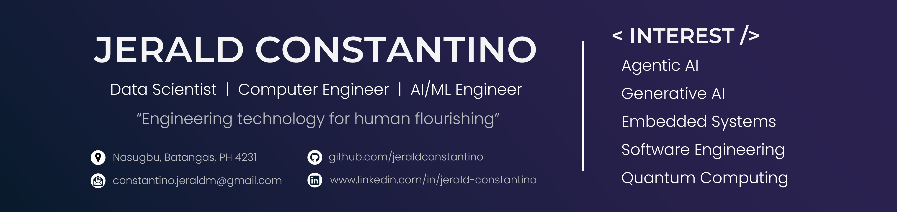

  
  
  

## About me

I build production-oriented AI systems across generative AI, computer vision, and intelligent automation. I enjoy taking projects from model experimentation to APIs, dashboards, embedded controllers, and real-world deployment.

| | |
| --- | --- |
| **Building** | [HANAS](https://github.com/jeraldconstantino/hanas), a safety-gated agentic AI system for hydroponic control |
| **Researching** | Reliable agentic AI for autonomous cyber-physical systems |
| **Open to** | Applied AI, computer vision, and intelligent automation collaborations |

## Featured projects

  <a href="https://github.com/jeraldconstantino/hanas">
    <picture>
      <source media="(prefers-color-scheme: dark)" srcset="https://github-readme-stats.vercel.app/api/pin/?username=jeraldconstantino&amp;repo=hanas&amp;theme=github_dark&amp;description_lines_count=2" />
      
    </picture>
  </a>
  <a href="https://github.com/jeraldconstantino/ai-assistant-rag">
    <picture>
      <source media="(prefers-color-scheme: dark)" srcset="https://github-readme-stats.vercel.app/api/pin/?username=jeraldconstantino&amp;repo=ai-assistant-rag&amp;theme=github_dark&amp;description_lines_count=2" />
      
    </picture>
  </a>

  <a href="https://github.com/jeraldconstantino/nitrate-sufficiency-monitoring-system">
    <picture>
      <source media="(prefers-color-scheme: dark)" srcset="https://github-readme-stats.vercel.app/api/pin/?username=jeraldconstantino&amp;repo=nitrate-sufficiency-monitoring-system&amp;theme=github_dark&amp;description_lines_count=2" />
      
    </picture>
  </a>
  <a href="https://github.com/jeraldconstantino/knee-osteoarthritis-detection">
    <picture>
      <source media="(prefers-color-scheme: dark)" srcset="https://github-readme-stats.vercel.app/api/pin/?username=jeraldconstantino&amp;repo=knee-osteoarthritis-detection&amp;theme=github_dark&amp;description_lines_count=2" />
      
    </picture>
  </a>

### My contribution

| Project | Role | Outcome |
| --- | --- | --- |
| **HANAS** | Lead researcher and primary developer | Traceable, safety-gated autonomous nutrient-regulation experiments |
| **RAG AI Assistant** | Independent developer | Searchable, conversational access to user-provided documents |
| **Nitrate Monitoring** | Project lead | Live machine-vision inference connected to automated physical control |
| **Knee Osteoarthritis Detection** | Project contributor | Instance-segmentation workflow for distinguishing healthy and degenerative knees in radiographs |

## Technical toolkit

| Area | Technologies |
| --- | --- |
| AI and machine learning |       |
| Backend and data |   |
| Interfaces and applications |     |
| Embedded systems |   |
| Tools and workflow |      |

## GitHub at a glance

  <picture>
    <source media="(prefers-color-scheme: dark)" srcset="https://github-readme-stats.vercel.app/api?username=jeraldconstantino&amp;show_icons=true&amp;hide_border=true&amp;theme=github_dark" />
    <source media="(prefers-color-scheme: light)" srcset="https://github-readme-stats.vercel.app/api?username=jeraldconstantino&amp;show_icons=true&amp;hide_border=true&amp;theme=default" />
    
  </picture>
  <picture>
    <source media="(prefers-color-scheme: dark)" srcset="https://streak-stats.demolab.com?user=jeraldconstantino&amp;hide_border=true&amp;theme=github-dark-blue" />
    <source media="(prefers-color-scheme: light)" srcset="https://streak-stats.demolab.com?user=jeraldconstantino&amp;hide_border=true&amp;theme=default" />
    
  </picture>

## Research background

**Graduate research** | MS Computer Engineering, Mapúa University (2024-present) 
Safety-Gated Agentic AI Cyber-Physical System for Autonomous pH and EC Regulation in Hydroponic Lettuce Cultivation

**Undergraduate research** | BS Computer Engineering, Batangas State University (2019-2023) 
Monitoring and Classification of Nitrate Sufficiency of an Aquaponic System Based on Lettuce Morphological Status Using a Machine Vision Approach 
Component of DOST-SC4P-CRADLE Project ATLANTIS

## Beyond the code

My guiding idea is **engineering technology for human flourishing**. I enjoy turning research into systems that interact with the physical world, especially in reliable AI, smart agriculture, and tools that make complex technical work easier for people.

## Let's connect

I enjoy meeting people working on useful, technically challenging AI products. Reach me through [LinkedIn](https://www.linkedin.com/in/jerald-constantino) or [email](mailto:constantino.jeraldm@gmail.com).
